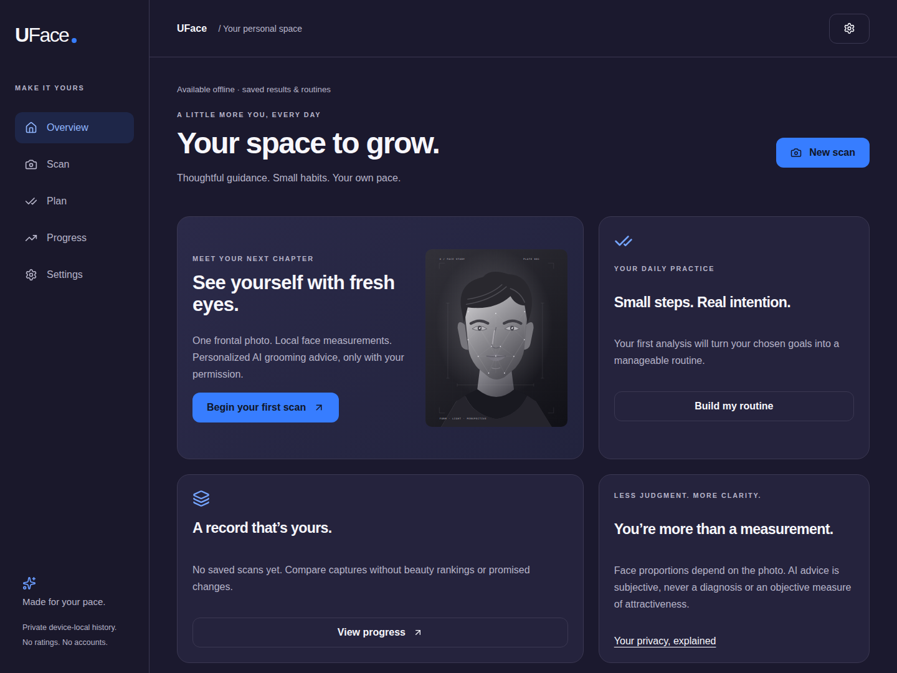
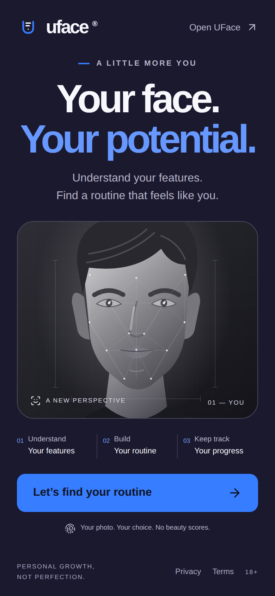

<p align="center">
  
</p>

<h1 align="center">UFace</h1>

<p align="center"><strong>Your face. Your potential.</strong></p>

<p align="center">
  Photo-aware grooming guidance. A routine that fits your life.<br />
  Local face measurements, personalized Gemini advice, and progress that stays in your browser.
</p>

<p align="center">
  <a href="#quick-start">Run locally</a> ·
  <a href="#what-you-can-do">Features</a> ·
  <a href="#privacy-by-design">Privacy</a> ·
  <a href="#production--pwa">Deployment</a>
</p>

<p align="center">
  
  
</p>

<p align="center"><sub>Actual desktop and mobile screens from a clean installation. Original UFace artwork; no seeded reports or fabricated scores.</sub></p>

## A little more you. Not a number.

UFace helps adults explore everyday grooming and presentation without turning their face into a rating. Start with your goals, add one frontal photo, review local photo checks, and choose whether to ask Google Gemini for practical suggestions.

**No beauty scores. No accounts. No billing screens. No UFace cloud history.**

## What you can do

| | |
| --- | --- |
| **Make it personal** | Choose hair, skin care, facial hair, or photo-presentation goals. Set your daily time, budget, and experience. |
| **Check before sending** | Run real MediaPipe face detection in a browser worker. Review photo-dependent proportions, tilt, and lighting/framing warnings before any analysis upload. |
| **Get useful advice** | Request structured Gemini suggestions and a daily, weekly, or one-time routine. Unusable photos get retake guidance, not invented results. |
| **Build a routine** | Check off actions with daily and weekly resets. One-time actions stay completed, and each scan keeps its own plan. |
| **Keep your own record** | Revisit saved reports and compare captures side by side. Saving the photo itself is a separate opt-in. |
| **Take it with you** | Use the responsive desktop/mobile interface or install the PWA where supported. Cached results and routines remain usable offline. |

## How it works

1. **Prepare locally.** Your browser checks the file, applies orientation, and re-encodes a metadata-stripped JPEG. JPEG, PNG, and WebP inputs are supported, up to 10 MiB; animated inputs become a static preview.
2. **Measure locally.** A same-origin MediaPipe model runs in a worker. UFace measures the leveled face-outline height/width, eye-center spacing/face width, and photo tilt. These are image-space observations—not clinical measurements or ideal ratios.
3. **Ask with permission.** Only an explicit submit with fresh, Gemini-specific consent sends the normalized photo, profile, measurements, and warnings through the Node server to Google Gemini.
4. **Save on your device.** Successful advice goes to IndexedDB. Photos are stored only when opted in. If storage fails, UFace keeps the current result in memory and offers a save retry without another AI request.

There is no continuous camera stream, server-side photo library, or automatic provider fallback. New analysis requires internet access; the application never substitutes a simulated report.

## Quick start

Use **Node.js 24** and npm. You will need network access for dependency installation and the first model download.

```bash
git clone https://github.com/LunarithmAI/UFace.git
cd UFace
npm ci
cp .env.example .env.local
```

Set `GEMINI_API_KEY` in `.env.local` to a key from a **billing-enabled Google Cloud project**, then start the app:

```bash
npm run dev
```

Open **[localhost:3000](http://localhost:3000)**.

The predev script prepares the local vision assets automatically. It copies the pinned MediaPipe runtime, verifies the face-model SHA-256 against `model-assets.lock.json`, bundles the worker, and generates app icons. Inference loads these assets from your own origin—not a runtime CDN.

You can explore onboarding and the app shell without a key. Remote analysis will return an explicit configuration error until a valid key is configured.

### Configuration

| Variable | Purpose | Default |
| --- | --- | --- |
| `GEMINI_API_KEY` | Server-only key for a billing-enabled Gemini project | Required for analysis |
| `GEMINI_MODEL` | Gemini model used for image advice | `gemini-3.5-flash-lite` |
| `ANALYSIS_DAILY_LIMIT` | Global upstream-attempt allowance per UTC day | `50` |

Never put a key in a `NEXT_PUBLIC_*` variable, client code, or a commit. Local `.env` files are ignored; `.env.example` contains no credentials.

### Development commands

```bash
npm run assets     # Prepare and verify vision assets and app icons
npm run typecheck  # Strict TypeScript checks
npm test           # Geometry, request limits, consent, and provider regressions
npm run build      # Production app plus build-specific offline shell
npm start          # Serve the production build
```

## Production & PWA

Deploy **one Node process behind HTTPS**. This is a server-backed Next.js app, not a static export. The reverse proxy must preserve the external `Host` and `X-Forwarded-Proto` so same-origin upload checks remain correct.

```bash
npm ci
# Configure the server environment or .env.local before starting.
npm run build
npm start
```

- **Bounded requests:** validated multipart uploads, a 4 MiB request cap, and normalized JPEG validation before contacting Gemini.
- **Bounded spending:** at most two concurrent provider requests, a configurable daily attempt limit, a 60-second timeout, and no automatic retries.
- **Deployment boundary:** limits are global, in memory, and reset on process restart. They are not authentication, per-user quotas, or a distributed limiter. Do not run independent replicas without revisiting this design.
- **Genuine offline shell:** production builds cache public pages and application assets. API responses, personal photos, and user records are never placed in Cache Storage.
- **User-controlled updates:** new service workers wait for approval; updates are disabled while photo processing or analysis is active.

Visit the production app online once to prepare offline access. Installation depends on the browser; UFace offers a real install prompt when available and platform instructions otherwise. HTTPS is required except on localhost. Service workers are not registered in development, and new AI analysis does not work offline.

## Privacy by design

**Local history is not cloud backup.** Reports, profile answers, checkmarks, and opted-in photos live in this browser's IndexedDB. Someone sharing the browser profile may access them. Browser storage can be cleared or evicted; it is not guaranteed permanent or encrypted storage.

**Your photo is not uploaded on selection.** The capture flow asks for separate adult/own-photo and Gemini-transfer consent. Photo retention on the device is a third, optional choice. Full face meshes and consent-checkbox state are not saved.

**The UFace server does not persist photos or results.** Gemini receives the consented input through an inline request, without the Files API or conversation history. Optional request logging is disabled with `store: false`; this does not remove Google's safety or legal retention obligations.

**Use paid Gemini services for personal photos.** Google's unpaid-service terms allow product-improvement use and human review and instruct users not to submit personal, sensitive, or confidential information. Under paid-service terms, prompts and responses are not used to improve Google's products, but limited safety/legal retention can still apply. Review the [Gemini API data-use terms](https://ai.google.dev/gemini-api/terms) before deployment.

Delete a scan to remove its local report, retained photo, and checklist history together. Settings also offers **Delete all my data**. Local deletion cannot undo an already transmitted provider request or remove external backups.

Read the app's [privacy page source](src/app/privacy/page.tsx) and [terms page source](src/app/terms/page.tsx) for the user-facing notices.

## Built with

- **Next.js 16 + React 19** — App Router, responsive CSS, and the Node API route.
- **TypeScript + Zod** — shared contracts and validated structured advice.
- **MediaPipe Tasks Vision** — pinned, same-origin CPU face landmarks in a worker.
- **Google Gemini** — native REST image analysis; default `gemini-3.5-flash-lite`.
- **IndexedDB via idb** — device-local reports, photos, profile, and routine completion.
- **Sharp + esbuild** — server image validation, generated icons, and worker bundling.
- **Native service worker** — explicit, build-versioned public-shell caching.

## Keep a healthy perspective

UFace is for **adults 18+ using their own photos**. Advice is subjective, photo-dependent, and non-medical. It is not an identity check, diagnosis, attractiveness rating, or promise of physical change. Differences between scans may simply reflect lighting, pose, or camera distance.

---

<p align="center">Built by <a href="https://github.com/LunarithmAI">LunarithmAI</a> · <a href="https://github.com/LunarithmAI/UFace/issues">Report an issue</a></p>
